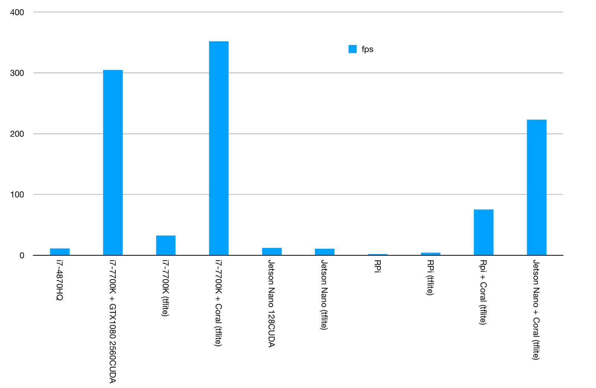

## Motivation

> I hear and I forget. I see and I remember. I do and I understand.

After reading up some [nice stats](https://blog.raccoons.be/coral-tpu-jetson-nano-performance) Google Coral Edge TPUs by Sam Sterckval at @RacoonsGroup, I got curious.

_Disclaimer: This is a work in progress!_

Here you can see his data on how Coral leaves NVIDIA's GTX1080 in the dust:

while graphing the fps these setups can to using the [MobileNetV2](https://arxiv.org/abs/1801.04381) classifier pre-trained on the ImageNet dataset. Yup, this is all about inference. No training data.

## Hardware

It looks like this:

![] (../assets/img/20200125_CoralPicture.png)

from the interesting side. And boring from the other, but you can look this up on the internets.

## Software

## Sources

