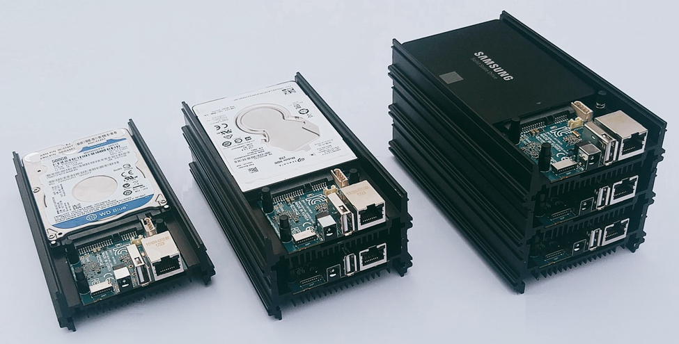

The [Odroid-HC2: Home Cloud One](https://www.hardkernel.com/shop/odroid-hc1-home-cloud-one/) by hardkernel is an interesting piece of hardware. It sports an Arm architecture called *big.LITTLE* where a relatively battery-saving CPU (LITTLE) is combined with a more powerful CPU (big). The Odroid comes with a Samsung Exynos5422 ARM® Cortex™-A15 Quad 2.0GHz/Cortex™-A7 Quad 1.4GHz.

We will create an extensbile NAS with as little as effort as possible.

<!-- more -->
